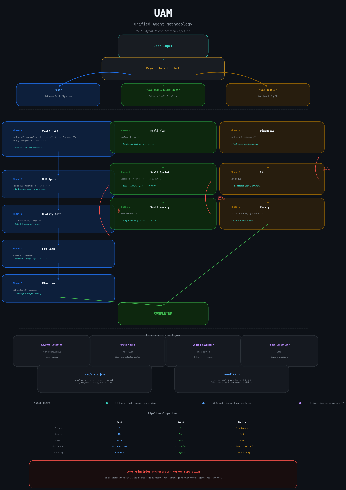

# UAM (Unified Agent Methodology)

A **standalone** multi-agent orchestration plugin for Claude Code.
Orchestrates 12 specialized AI agents through structured pipelines to automate planning, implementation, and verification of software features.

**Zero external dependencies** — requires only Claude Code + Node.js 16+.

> **[한국어 문서 (Korean)](docs/README_ko.md)**

---

## Architecture



---

## Overview

### Design Principles

1. **Orchestrator-Worker Separation** — The orchestrator never writes source code directly. All code changes are delegated to worker agents. (Hard-enforced via PreToolUse hook)
2. **Plan-First Execution** — PLAN.md is always created before implementation. Its checkboxes serve as the Single Source of Truth (SSOT).
3. **Test-Based Verification** — Objective test results replace subjective "done" claims.
4. **Bounded Retries** — Adaptive failure handling prevents infinite loops (immediate fix → session reset → circuit breaker).
5. **Knowledge Accumulation** — Learnings are structured into persistent files across iterations.

---

## Quick Start

### Activation

**Keyword auto-activation (recommended):**
```
"uam build the auth feature"
```
The `uam-keyword-detector` hook automatically initializes `.uam/state.json` and activates the pipeline.

**Direct skill invocation:**
```
/uam:uam           # Full 5-phase pipeline
/uam:uam-small     # Lightweight 3-phase pipeline
```

### Auto-Routing

The keyword detector analyzes user input and selects the appropriate pipeline:

| Keyword Pattern | Pipeline | Phases | Token Budget | Best For |
|----------------|----------|--------|-------------|----------|
| `uam bugfix` | Bugfix | Fix only | ~30K | Single bug fixes |
| `uam small`, `uam quick`, `uam light` | **Small** | 3 | ~70K | Everyday features (1-5 files) |
| `uam` | Full | 5 | ~167K | Complex features, refactoring |

---

## Pipelines

### Full Pipeline (5 Phases)

```
Phase 1: Quick Plan
  ↓  (PLAN.md generated, 1x HITL approval)
Phase 2: MVP Sprint
  ↓  (parallel TODO implementation)
Phase 3: Quality Gate
  ├→ All pass: Phase 5
  └→ Any fail: Phase 4
Phase 4: Fix Loop
  ├→ Pass: re-enter Phase 3
  ├→ Structural failure: re-enter Phase 1
  └→ Loop limit reached: Phase 5
Phase 5: Finalize
  (learning extraction, memory update, atomic commits)
```

### Small Pipeline (3 Phases)

```
Phase 1: Small Plan
  ↓  (2 agents: explore + pm, simplified PLAN.md)
Phase 2: Small Sprint
  ↓  (parallel workers, verify, commit)
Phase 3: Small Verify
  ↓  (single code review, max 3 retries)
Completed
```

| Aspect | Full | Small |
|--------|------|-------|
| Planning agents | 4-6 parallel | 2 parallel |
| PM model | Opus | Sonnet |
| Quality gates | 3 (docker + review + agent-as-user) | 1 (code review only) |
| Fix strategy | Adaptive 3-tier + ConvergenceDetector | Simple retry (max 3) |
| Token budget | 500K | 150K |
| Pivot Points | Full interview | Skipped |
| Learnings output | 4 files | 1 file (learnings.md only) |

---

## Skills & Commands

### Skills (10)

| Skill | Invocation | Purpose |
|-------|-----------|---------|
| **uam** | `/uam:uam` | Full 5-phase pipeline |
| **uam-small** | `/uam:uam-small` | Lightweight 3-phase pipeline |
| **uam-pivot** | `/uam:uam-pivot` | Pivot Points interview (immutable constraints) |
| **uam-status** | `/uam:uam-status` | Pipeline dashboard (phase, TODOs, gates, convergence) |
| **uam-cancel** | `/uam:uam-cancel` | Safe cancellation with state preservation |
| **uam-resume** | `/uam:uam-resume` | Resume cancelled pipeline from last phase |
| **uam-bugfix** | `/uam:uam-bugfix` | Standalone adaptive bug fixing (3 attempts + circuit breaker) |
| **uam-compound** | `/uam:uam-compound` | Learning extraction + knowledge distillation |
| **uam-manage** | `/uam:uam-manage` | Plugin management (status, update, uninstall, doctor) |
| **uam-migrate** | `/uam:uam-migrate` | Migrate from other orchestration systems (OMC, hoyeon) |

### Commands (2)

| Command | Purpose |
|---------|---------|
| `/uam:uam-run` | Full 5-phase orchestration protocol reference |
| `/uam:uam-small-run` | Lightweight 3-phase orchestration protocol reference |

### Skill Flow

```
/uam:uam-pivot (Pivot Points interview — Phase 0)
     │
     ▼
/uam:uam (full 5-phase pipeline)
 ├── /uam:uam-status     (check progress, anytime)
 ├── /uam:uam-cancel     (stop → preserve state)
 │    └── /uam:uam-resume (resume from preserved state)
 └── /uam:uam-compound   (extract learnings after completion)

/uam:uam-small (lightweight 3-phase pipeline)
 ├── /uam:uam-status
 ├── /uam:uam-cancel
 │    └── /uam:uam-resume
 └── /uam:uam-compound

/uam:uam-bugfix (standalone — outside pipeline)
 └── After 3 failures → suggests switching to /uam:uam
```

---

## Agent Catalog

### 12 Agents + Judge

| # | Agent | Default Model | Disallowed Tools | Phase | Role |
|---|-------|--------------|-----------------|-------|------|
| 1 | `uam-explore` | Haiku | Write, Edit, Task | 1 | Codebase structure exploration, file/symbol mapping |
| 2 | `uam-gap-analyzer` | Haiku | Write, Edit, Bash, Task | 1 | Missing requirements, AI pitfalls, Must NOT Do |
| 3 | `uam-tradeoff-analyzer` | Sonnet | Write, Edit, Bash, Task | 1 | Per-change risk assessment (LOW/MED/HIGH) |
| 4 | `uam-verification-planner` | Sonnet | Write, Edit, Bash, Task | 1 | A/S/H-item classification, 4-tier test strategy |
| 5 | `uam-pm` | **Opus** | Write, Edit, Bash, Task | 1 | Requirements refinement, user stories, MoSCoW priority |
| 6 | `uam-designer` | Sonnet | Write, Edit, Bash, Task | 1 | UX/UI design, component structure, accessibility |
| 7 | `uam-researcher` | Sonnet | Write, Edit, Task | 1 | Technology research, prior art, library evaluation |
| 8 | `uam-worker` | Sonnet | **Task** | 2, 4 | TODO implementation (general), enforced JSON output |
| 9 | `uam-frontend` | Sonnet | **Task** | 2, 4 | Frontend implementation (UI/CSS/components) |
| 10 | `uam-git-master` | Sonnet | Write, Edit, Task | 2, 5 | Atomic commits, style detection |
| 11 | `uam-code-reviewer` | Sonnet | Write, Edit | 3 | Multi-model cross-review, 8-category verification |
| 12 | `uam-debugger` | Sonnet | Write, Edit, Task | 4 | Reverse callstack tracing, bug classification |
| — | **Judge** | (logic) | — | 3 | Docker pytest result adjudication, failure summary |

**Judge is not an agent** — it's orchestrator-internal logic for objective test result adjudication.

### Model Routing (Dynamic Escalation)

| Complexity | Model | When |
|-----------|-------|------|
| Simple lookups | Haiku | explore, gap-analyzer |
| Standard work | Sonnet | worker, frontend, code-reviewer, debugger |
| Requirements/direction | **Opus (default)** | pm |
| Complex reasoning (escalated) | **Opus** | Ambiguous requirements, architecture changes, 3+ consecutive failures |

---

## Hook System

### 4 Hooks

| # | Hook | Event | Role | Enforcement |
|---|------|-------|------|-------------|
| 1 | `uam-write-guard.mjs` | PreToolUse (Edit/Write) | Block direct source file writes | **Hard block** |
| 2 | `uam-validate-output.mjs` | PostToolUse (Task) | Agent output schema validation reminder | Auto |
| 3 | `uam-phase-controller.mjs` | Stop | Phase transitions + loop continuation | State control |
| 4 | `uam-keyword-detector.mjs` | UserPromptSubmit | "uam" keyword detection + state init | Activation |

### Write Guard

When UAM is active, the orchestrator is blocked from writing source files directly:
- **Allowed paths**: `.uam/`, `.claude/`, `PLAN.md`, `docs/learnings/`
- **Blocked**: All source files (`.ts`, `.py`, `.js`, `.go`, `.rs`, `.java`, `.c`, `.cpp`, etc.)
- **Enforcement**: Hard block — operation does not proceed

### Phase Controller (Stop Hook)

Handles phase transitions for both full and small pipelines:

**Full pipeline**: `phase1-plan` → `phase2-sprint` → `phase3-gate` → `phase4-fix` ↔ `phase3-gate` → `phase5-finalize` → `completed`

**Small pipeline**: `small-plan` → `small-sprint` → `small-verify` ↔ `small-sprint` (max 3) → `completed`

---

## State Management

### Directory Structure

```
.uam/
├── state.json              # Pipeline state
├── PLAN.md                 # Phase 1 output (checkboxes = SSOT)
├── config.json             # UAM settings
├── context/                # Learnings, decisions, issues
├── gate-results/           # Gate 1-3 results (JSON)
├── fix-loop/               # Per-iteration failure summaries
├── sandbox/                # Docker test environment
└── bugfix-attempts.md      # Circuit breaker attempt log
```

### state.json Schema

```json
{
  "pipeline_id": "uam-20260228-auth-feature",
  "run_mode": "full",
  "current_phase": "phase2-sprint",
  "started_at": "2026-02-28T10:00:00Z",
  "plan_approved": true,
  "sprint_status": {
    "total_todos": 5,
    "completed_todos": 3,
    "in_progress_todos": 1,
    "failed_todos": 0
  },
  "gate_results": {
    "gate1_passed": null,
    "gate2_passed": null,
    "gate3_passed": null
  },
  "fix_loop_count": 0,
  "max_fix_loops": 10,
  "cost": {
    "total_tokens": 45000,
    "max_total_tokens": 500000
  }
}
```

### Key Concepts

- **PLAN.md SSOT**: Checkboxes (`[ ]`, `[x]`, `[FAILED]`) are the single source of truth for progress
- **A/S/H-items**: Verification strategy classification
  - **A-items**: Agent-Verifiable (automated command verification)
  - **S-items**: Sandbox Agent Testing (Agent-as-User verification)
  - **H-items**: Human-Required (human judgment needed)
- **Worker Scope**: Each worker implements exactly one TODO and cannot call other agents (Task tool disallowed)

---

## Project Structure

```
.claude-plugin/
└── plugin.json                 # Plugin manifest

agents/                          # 12 specialized agents
├── uam-explore.md
├── uam-gap-analyzer.md
├── uam-tradeoff-analyzer.md
├── uam-verification-planner.md
├── uam-pm.md
├── uam-designer.md
├── uam-researcher.md
├── uam-worker.md
├── uam-frontend.md
├── uam-git-master.md
├── uam-code-reviewer.md
└── uam-debugger.md

hooks/                           # 4 hooks + utilities
├── hooks.json
├── lib/
│   ├── uam-state.mjs
│   └── stdin.mjs
├── uam-write-guard.mjs
├── uam-validate-output.mjs
├── uam-phase-controller.mjs
└── uam-keyword-detector.mjs

commands/                        # 2 commands
├── uam-run.md
└── uam-small-run.md

skills/                          # 10 skills
├── uam/SKILL.md
├── uam-small/SKILL.md
├── uam-pivot/SKILL.md
├── uam-status/SKILL.md
├── uam-cancel/SKILL.md
├── uam-resume/SKILL.md
├── uam-bugfix/SKILL.md
├── uam-compound/SKILL.md
├── uam-manage/SKILL.md
└── uam-migrate/SKILL.md

docs/
├── design_unified_agent_methodology.md   # Full design specification
└── README_ko.md                          # Korean documentation
```

---

## Installation

### One-command install

```bash
git clone <repo-url>
cd uam
./install.sh          # 대화형: global/project 선택
./install.sh --global # 모든 프로젝트에서 사용
./install.sh --project # 현재 프로젝트에서만 사용
```

Claude Code를 재시작하면 활성화.

### Uninstall

```bash
./uninstall.sh          # 심링크 제거
./uninstall.sh --clean  # + .uam/ 상태 파일 제거
```

### Verify

Claude Code에서:
```
/uam:uam-manage status
```

### Requirements

- Node.js 16+ (for `.mjs` hook execution)
- Claude Code with plugin support

### Manual Setup (alternative)

```bash
# 1. Create required directories
mkdir -p .uam/{context,gate-results,fix-loop,sandbox}
mkdir -p docs/learnings

# 2. Initialize state (or let keyword hook do it automatically)
echo '{}' > .uam/state.json

# 3. Verify hooks are registered
cat .claude/settings.json | jq '.hooks'
```

### Deactivation

UAM deactivates automatically when a pipeline completes or is cancelled:

```json
{ "current_phase": "completed" }
```

All hooks silently pass when UAM is inactive — no interference with normal workflows.

---

## Troubleshooting

| Problem | Cause | Solution |
|---------|-------|----------|
| Hooks not working | Not registered in settings.json | Check `.claude/settings.json` hooks section |
| Write guard not blocking | UAM not active | Verify `.uam/state.json` exists with active phase |
| PLAN.md checkboxes not updating | Orchestrator must update manually | Update after Worker + Verify both pass |
| Phase transition delayed | PLAN.md format mismatch | Ensure format: `### [ ]`, `### [x]`, `### [FAILED]` |

---

## Glossary

| Term | Definition |
|------|-----------|
| **A-items** | Agent-Verifiable tests (exit code based) |
| **S-items** | Sandbox Agent Testing (Agent-as-User in Docker) |
| **H-items** | Human-Required verification items |
| **SSOT** | Single Source of Truth (PLAN.md checkboxes) |
| **DAG append-only** | Completed tasks are never re-executed; new instances are created |
| **Circuit breaker** | Escalation to higher phase on repeated failures |
| **ConvergenceDetector** | Pass rate trend analysis for stagnation/regression detection |
| **Verify Worker** | Orchestrator independently re-runs acceptance criteria |
| **Graceful Degradation** | Fallback to SKIPPED/DEGRADED status when external tools fail |

---

## References

- **Design specification**: [`docs/design_unified_agent_methodology.md`](docs/design_unified_agent_methodology.md)
- **Korean documentation**: [`docs/README_ko.md`](docs/README_ko.md)

### Influenced By

UAM's design draws on ideas from these agent orchestration systems:

- **[oh-my-claudecode (OMC)](https://github.com/nicobailey-llc/oh-my-claudecode)** — Multi-agent orchestration layer for Claude Code. Parallel execution, keyword auto-activation, status dashboard.
- **[hoyeon](https://github.com/hoyeonkim795/hoyeon-claude-code)** — Strict orchestrator-worker separation, fat skill architecture, circuit breaker patterns.

---

**UAM is a standalone agent orchestration plugin for Claude Code. It runs entirely on Claude Code + Node.js with zero external dependencies.**
